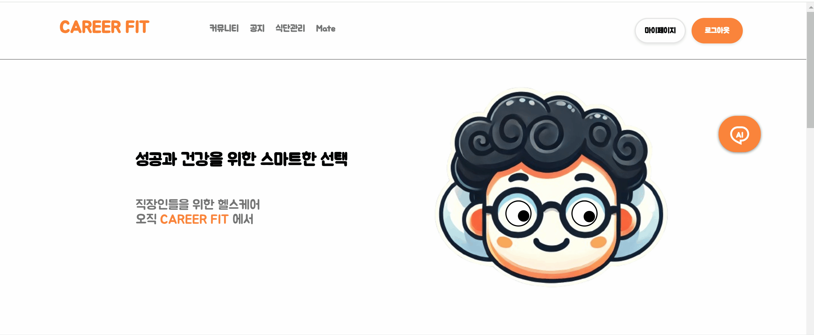
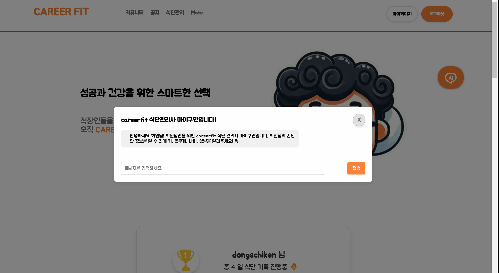
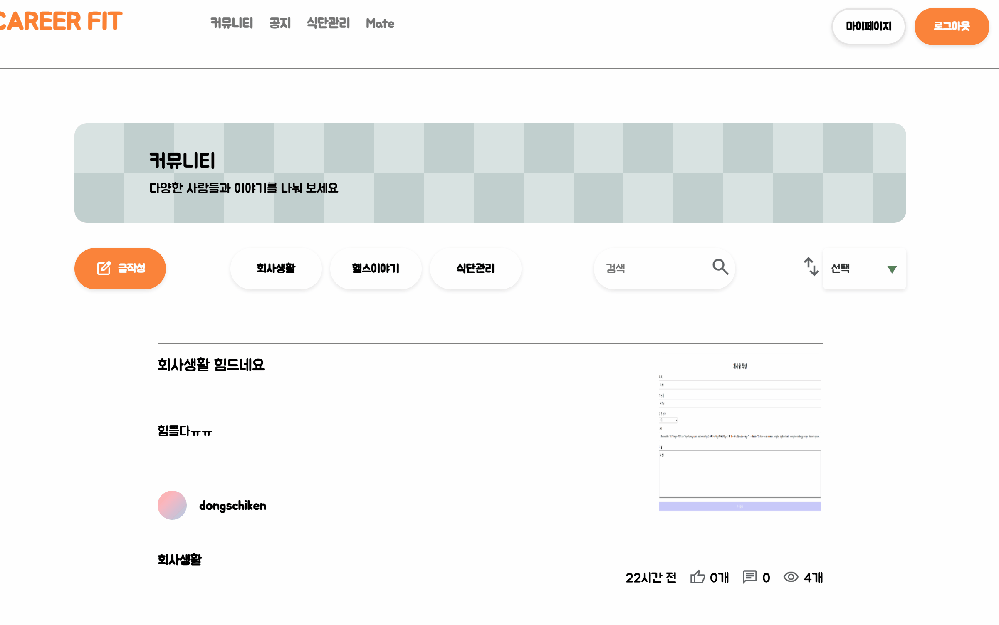
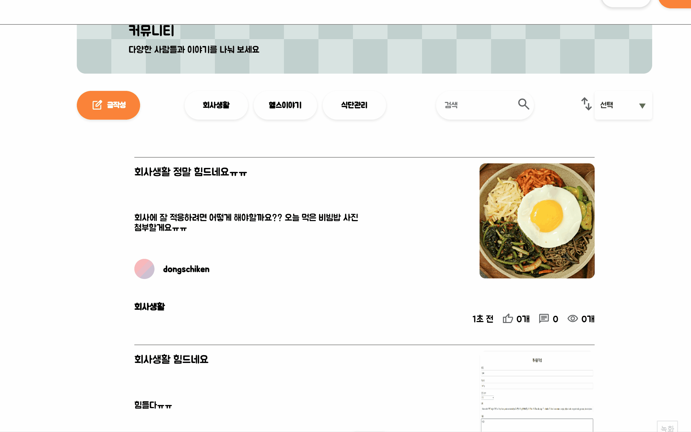
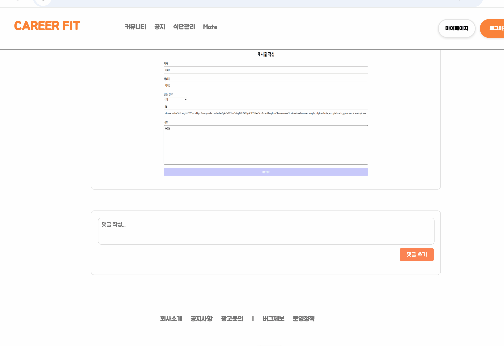
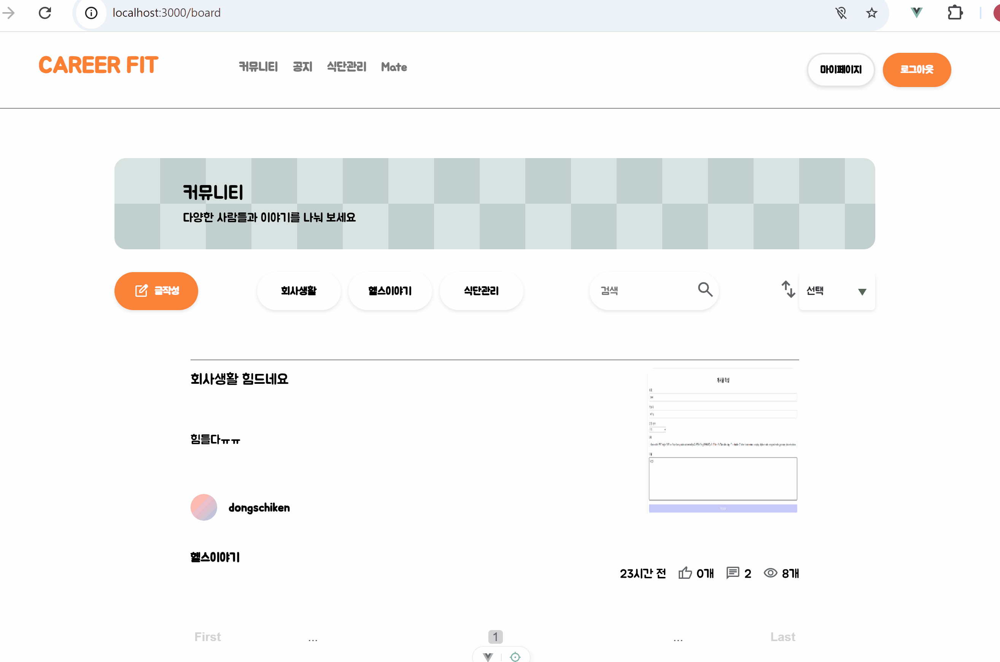
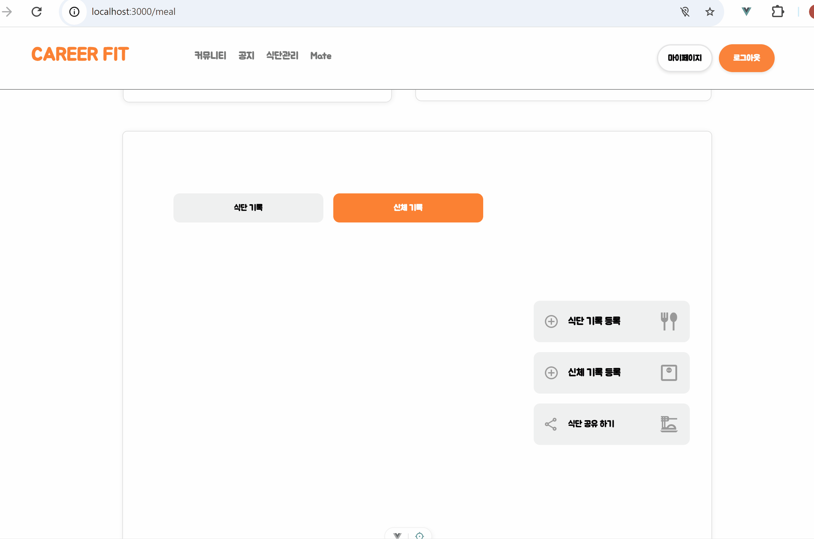
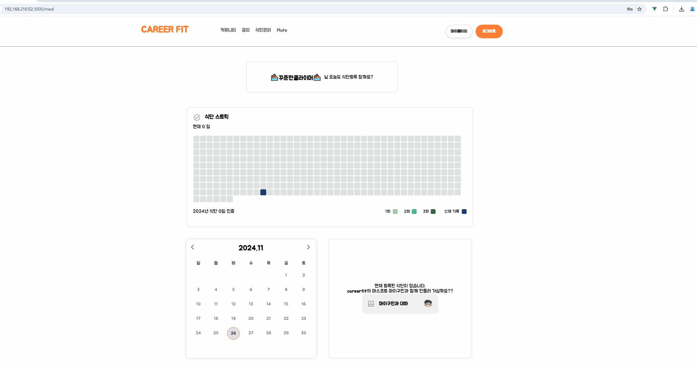
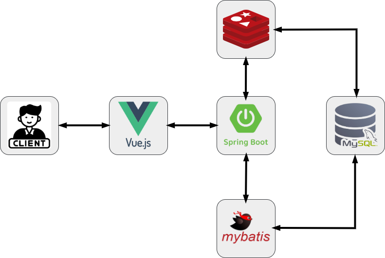

  <h1>CAREERFIT</h1>
  
퇴근 후 바쁜 직장인들을 위한 <strong>식단 관리</strong>와 <strong>채팅</strong>, 모두 한곳에서!

  

    <strong>CAREERFIT</strong>은 온라인 어플리케이션으로,
     
    회원들에게 AI 식단관리 기능과 채팅 기능을 제공하여
     
    다양한 사람들과 소통할 수 있도록 지원합니다.
  

---

## 메인 화면

### CAREERFIT 마스코트 "마이구민"

  

---

### 마이구민 아이트래킹

  

### 마이구민의 식단 추천

  <h4>AI 식단 추천</h4>
  
CAREERFIT의 마스코트 Chatbot <strong>마이구민</strong>을 통해 식단과 운동을 추천받을 수 있습니다.

  

 
 
 
 

## 게시판 기능

<table>
  <tr>
    <td align="center" width="50%">
      <h4>게시글 등록</h4>
      
카테고리, 제목, 내용, 사진을 입력해 게시글을 등록할 수 있습니다.

      
    </td>
    <td align="center" width="50%">
      <h4>게시물 검색</h4>
      
내용, 제목, 닉네임을 검색하거나 최신순, 조회순으로 정렬할 수 있습니다.

      
    </td>
  </tr>
</table>

  <h4>게시물 상세</h4>
  
게시물 상세 화면에서 내용을 확인하고, 본인이 작성한 게시물은 수정/삭제할 수 있습니다.

  

 
 
 
 

## 댓글 기능

  <h4>댓글 작성</h4>
  
댓글을 작성해서 댓글 쓰기 버튼을 클릭하면 내가 쓴 댓글이 등록된다..

  

  <h4>대댓글 작성</h4>
  
댓글을 작성해서 댓글 쓰기 버튼을 클릭하면 내가 쓴 댓글이 등록된다..

  

 
 
 
 

## 식단관리

  <h4>ai 추천 식단 등록</h4>
  
댓글을 작성해서 댓글 쓰기 버튼을 클릭하면 내가 쓴 댓글이 등록된다..

  

  <h4>식단 기록 등록</h4>
  
댓글을 작성해서 댓글 쓰기 버튼을 클릭하면 내가 쓴 댓글이 등록된다..

  

  <h4>신체 기록 등록</h4>
  
댓글을 작성해서 댓글 쓰기 버튼을 클릭하면 내가 쓴 댓글이 등록된다..

  

  <h4>식단 스트릭</h4>
  
댓글을 작성해서 댓글 쓰기 버튼을 클릭하면 내가 쓴 댓글이 등록된다..

  

 
 
 
 

## 메이트

  <h4>지도 검색</h4>
  
검색을 통해 원하는 장소를 찾을 수 있고, 반경 1, 3, 5km를 정해서 운동시설을 찾을 수 있다. 
     
    또한 헬스장, 클라이밍, 공원 등의 카테고리를 검색해서 정확하게 원하는 운동 시설을 검색가능하다.
  

  

  <h4>마커 채팅방</h4>
  
지도의 마커에 현재 운동시설에 등록되어 있는 채팅방 목록을 볼 수 있다.

  

  <h4>채팅방 만들기</h4>
  
댓글을 작성해서 댓글 쓰기 버튼을 클릭하면 내가 쓴 댓글이 등록된다..

  

  <h4>여러명의 유저와 채팅하기</h4>
  
댓글을 작성해서 댓글 쓰기 버튼을 클릭하면 내가 쓴 댓글이 등록된다..

  

 
 
 
 

## 마이페이지

 
 
 
 

## 팀원 소개

  <table>
    <tr>
      <th align="center" width="50%">Backend</th>
      <th align="center" width="50%">Backend</th>
    </tr>
    <tr>
      <td align="center">
        
         
        <a href="https://github.com/dongschiken">dongs</a> ✨
      </td>
      <td align="center">
        
         
        <a href="https://github.com/KOOMINSEOK9">민석</a> 🐿️
      </td>
    </tr>
    <tr>
      <td align="center">
        <ul>
          <li>🫀 책임감 있고 팀에 주인의식을 가지는 기획자</li>
          <li>⭐️ 고객 중심의 비즈니스 전문가</li>
          <li>👩🏻‍💻 학습속도가 빠르고 기본기가 탄탄합니다.</li>
        </ul>
      </td>
      <td align="center">
        <ul>
          <li>👀 다양한 영역에 대한 통찰력과 이해력</li>
          <li>😎 맡은 일을 책임감 있게 해냅니다.</li>
          <li>🧑‍💻 기술 도입에 신중하며 합리적인 판단을 합니다.</li>
        </ul>
      </td>
    </tr>
  </table>

## 클라이언트 요청 흐름도

  

